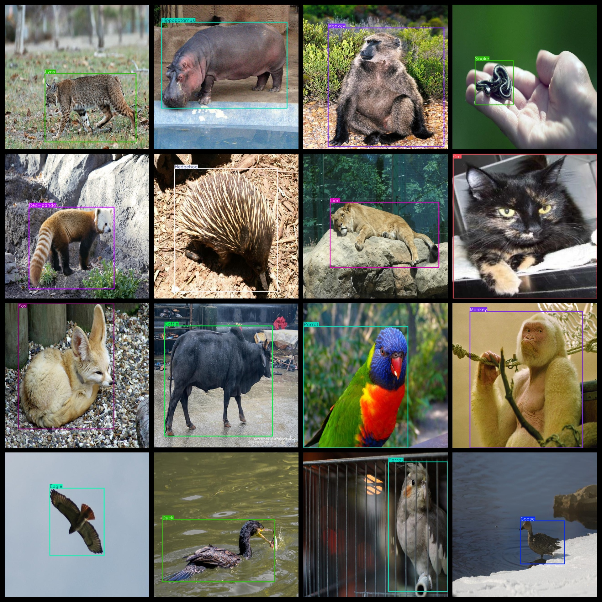
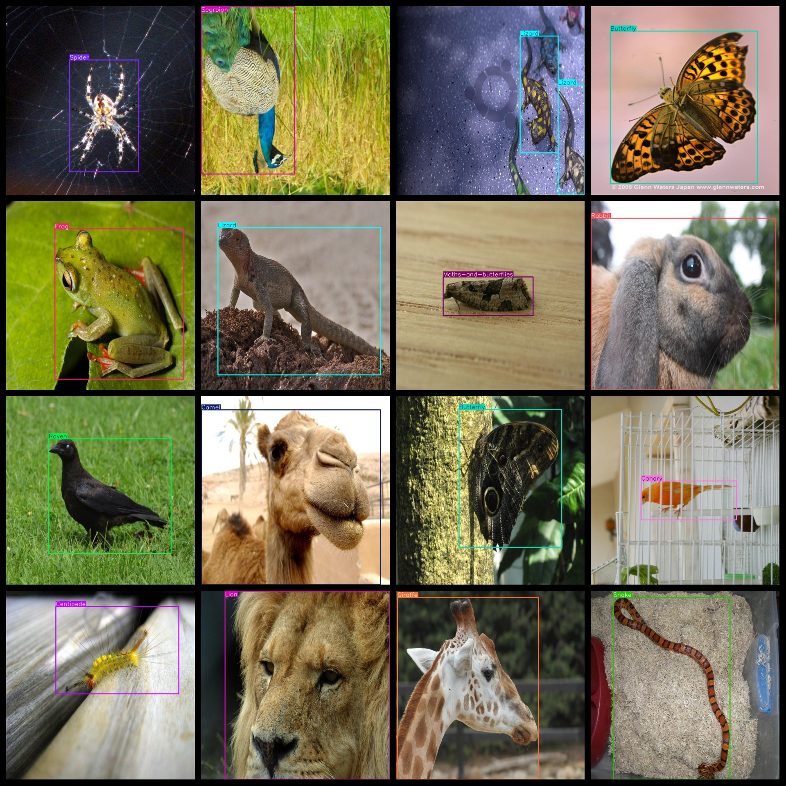
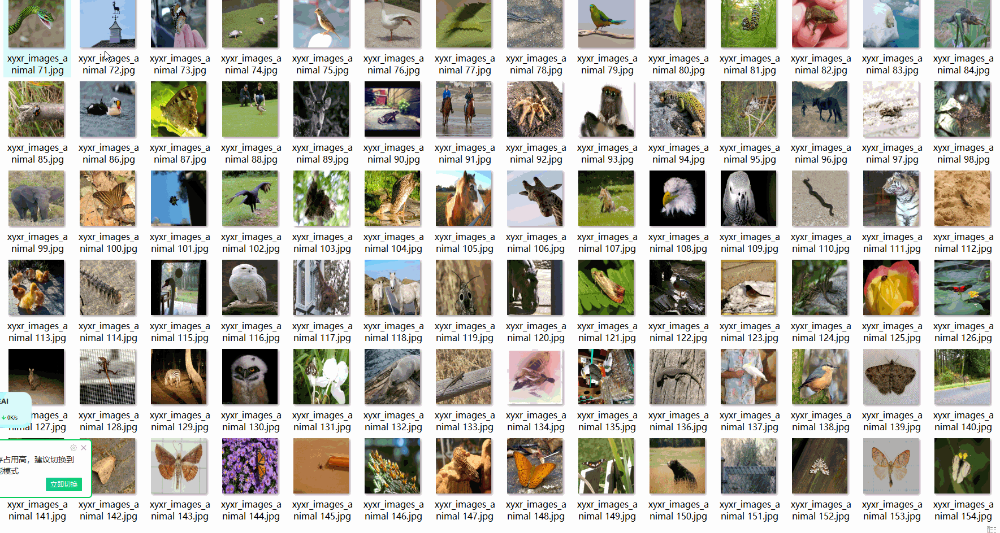

# 61 types Animal Dataset 22755 images VOC+YOLO format

The dataset format is Pascal VOC and YOLO, excluding the split-path txt file; it contains only jpg images along with the corresponding VOC-format xml files and YOLO-format txt files.

Total number of jpg files: 22755

Number of XML files: 22,755

Number of txt files: 22755

Category count: 61

The Github repository is: datasets_sl

Preserve the original meaning, format markers (【】『』「」<>[]), numbers, English words, and special characters as-is. Output ONLY the English translation, no explanations, no quotes.

Bear
Brown-bear
Bull
Butterfly
Camel
Canary
Cat
Caterpillar
Cattle
Centipede
Cheetah
Chicken
Deer
Duck
Eagle
Elephant
Fox
Frog
Giraffe
Goose
Goose
Hamster
Hedgehog
Hippopotamus
Horse
Jaguar
Jellyfish
Kangaroo
Koala
Ladybug
Leopard
Lion
Lizard
Lynx
Magpie
Monkey
Moths-and-butterflies
Mouse
Mule
Ostrich
Otter
Owl
Panda
Parrot
Pig
Polar-bear
Rabbit
Raccoon
Raven
Red-panda
Rhinoceros
Scorpion
Sheep
Snake
Sparrow
Spider
Swan
Tiger
Turkey
Woodpecker
Zebra

Label Chinese translation: 

Bear frame count = 137

Brown-bear frame count = 160

Bull frame count = 82

Butterfly frame count = 3136

Camel frame count = 94

Canary frame count = 134

Cat frame count = 443

Caterpillar frame count = 555

Cattle frame count = 314

Centipede frame count = 257

Cheetah frame count = 97

Chicken frame count = 602

Deer frame count = 662

Duck frame count = 853

Eagle frame count = 983

Elephant frame count = 252

Fox frame count = 222

Frog frame count = 682

Giraffe frame count = 361

Goat frame count = 304

Goose frame count = 358

Hamster frame count = 40

Hedgehog frame count = 160

Hippopotamus frame count = 124

Horse frame count = 651

Jaguar frame count = 72

Jellyfish frame count = 110

Kangaroo frame count = 160

Koala frame count = 57

Ladybug frame count = 431

Leopard frame count = 182

Lion frame count = 318

Lizard frame count = 1522

Lynx frame count = 133

Magpie frame count = 107

Monkey frame count = 1208

Moths-and-butterflies frame count = 1496

Mouse frame count = 236

Mule frame count = 121

Ostrich frame count = 253

Otter frame count = 150

Owl frame count = 512

Panda frame count = 112

Parrot frame count = 798

Pig frame count = 364

Polar-bear frame count = 307

Rabbit frame count = 358

Raccoon frame count = 165

Raven frame count = 165

Red-panda frame count = 99

Rhinoceros frame count = 298

Scorpion frame count = 280

Sheep frame count = 281

Snake frame count = 799

Sparrow frame count = 730

Spider frame count = 1194

Swan frame count = 368

Tiger frame count = 435

Turkey frame count = 156

Woodpecker frame count = 407

Zebra frame count = 268
## Images

---

Here is a pay link on Stripe (https://buy.stripe.com/3cs8yP7sY87d0vu9AB). Please contact me lonlonago@foxmail.com after funding $89, and I will send you a complete data files, thank you!

